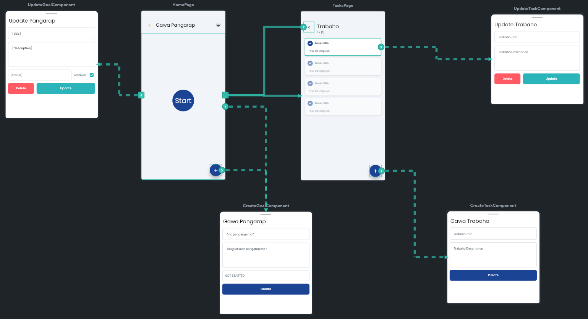

# Pangarap

Pangarap is a goal-setting app built with FlutterFlow, aimed at helping users organize, visualize, and track their dreams and aspirations. The app provides an intuitive and engaging platform where users can set, manage, and monitor their goals over time.

## Built With FlutterFlow

## Clone it here: (https://tinyurl.com/22uf9nv6)

 
